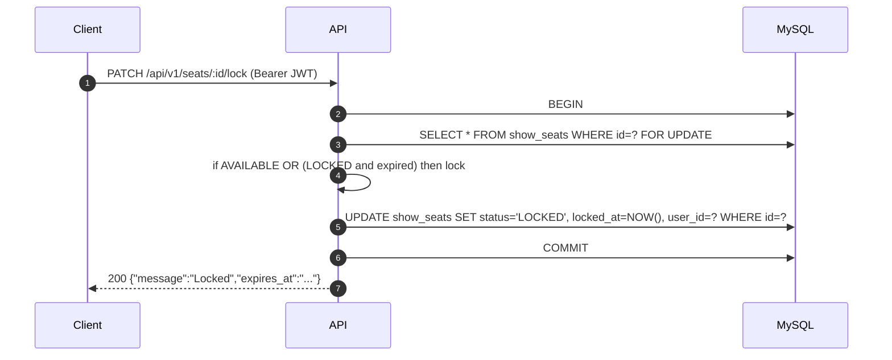
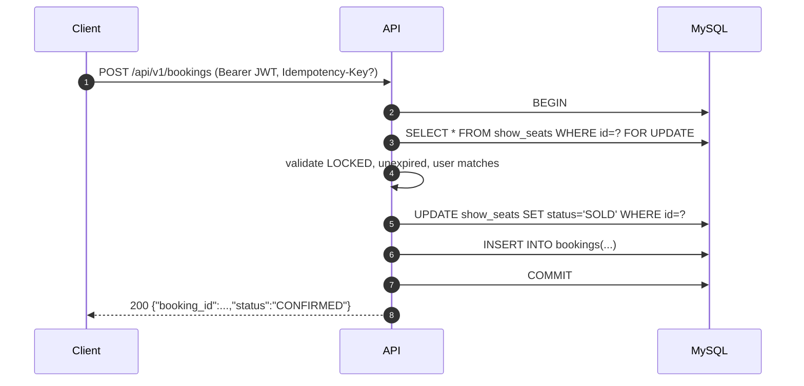

# MVP design (Go monolith + MySQL)

This design implements the HLD (`docs/movie_hld.txt`) using the repo conventions from the onboarding guide (`docs/go-onboarding-guide.txt`).

## Service boundary (MVP)

Single Go service that owns:

- Authentication (`POST /api/v1/login`) issuing stateless JWTs.
- Movie browsing (`GET /api/v1/movies`).
- Show listing by movie (`GET /api/v1/movies/:id/shows`).
- Seat grid/status (`GET /api/v1/shows/:id/seats`).
- Seat locking with 10-minute holds (`PATCH /api/v1/seats/:id/lock`).
- Booking confirmation (`POST /api/v1/bookings`).

## Seat locking strategy (HLD concurrency core)

- Use a **MySQL transaction** and **row-level locking**: `SELECT ... FOR UPDATE` on the `show_seats` row.
- Validate seat state:
  - Allow lock if `status == AVAILABLE`, or if `status == LOCKED` but the lock is **expired** (`locked_at < now - 10m`).
- On lock:
  - Set `status = LOCKED`, `locked_at = now`, `user_id = <caller>`.
  - Return `expires_at = locked_at + 10m`.
- Lazy lock expiration:
  - On `GET /shows/:id/seats`, seats with expired locks are returned as `AVAILABLE` and (optionally) updated in DB during the request.
  - On lock/book endpoints, expired locks are treated as AVAILABLE.

## Booking confirmation

- Booking converts a valid lock into a sale:
  - Requires the seat to be `LOCKED`, **unexpired**, and locked by the same user.
  - Within a transaction: `SELECT ... FOR UPDATE`, validate, set `status=SOLD`, create `bookings` row, commit.
- **Idempotency** (plan requirement):
  - Optional `Idempotency-Key` header on `POST /api/v1/bookings`.
  - If present and a booking already exists for `(user_id, idempotency_key)`, return the existing booking instead of creating a new one.

## Auth (JWT)

- `POST /api/v1/login` validates email/password and returns a JWT.
- Requests to **lock** and **book** must include `Authorization: Bearer <token>`.
- Tokens are signed with **RS256** and expire within **15 minutes** (per onboarding guide security section).

## Key sequence flows

