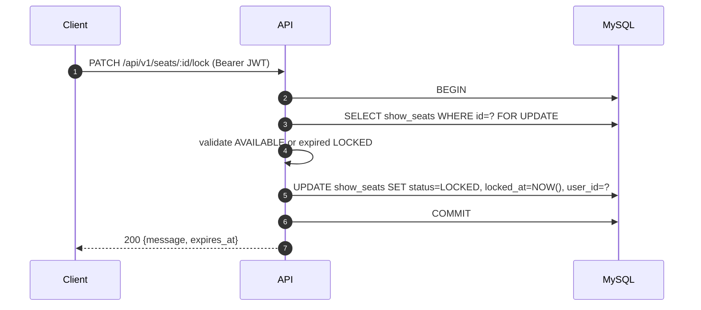
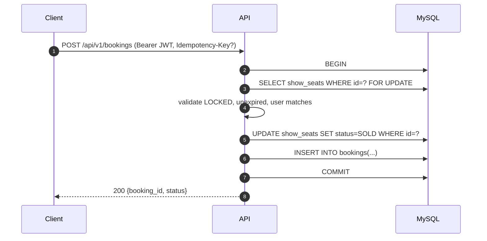

# Movie Booking — High Level Design (HLD v2)

This document is a guidelines-compliant rewrite of `docs/movie_hld.txt`, aligned with the patterns and standards in `docs/go-onboarding-guide.txt` (3-layer architecture, error/logging conventions, DB safety, and test strategy).

## 1) Context / Problem

We need a system to handle movie seat reservations during high-traffic windows (1000+ concurrent users) while preventing race conditions (double-booking) and supporting temporary seat holds.

## 2) Goals

- Prevent double booking under high concurrency.
- Support **10-minute seat holds** (LOCKED → expires → AVAILABLE) without background cleaners.
- Keep the service stateless for horizontal scalability.
- Provide a small, well-scoped MVP REST API.

## 3) Non-goals (MVP)

- Dynamic pricing, promotions, loyalty, refunds.
- Complex seat-map rendering concerns (pure backend; client owns UI).
- Distributed locking / Redis holds (we intentionally keep holds in MySQL).

## 4) Architecture Overview (MVP)

- **Service**: containerized **Go monolith**
- **API**: REST
- **DB**: MySQL
- **Deployment**: Docker Compose for environment parity

### 4.1 Three-layer architecture (required)

Per onboarding guide: **data flows down, errors flow up; never skip layers**.

- **API layer**: `api/v1/controllers/` (HTTP parsing/validation + response formatting only)
- **Service layer**: `core/services/` (business logic + orchestration)
- **DataStore layer**: `datastore/` (GORM queries, transactions, row locks)

### 4.2 Suggested repository layout (required)

Follow the onboarding guide structure:

- `cmd/main.go` (`--api`, `--migrate`)
- `api/v1/router.go`, `api/v1/controllers/`, `api/v1/helpers/`, `api/v1/types/`
- `core/model/`, `core/services/`
- `datastore/` (+ `fake/` for mocks)
- `config/` (Viper getters)
- `constants/` (no hardcoded strings)
- `dbmigrations/migrations/mysql/` (Goose)
- `tests/` (integration/e2e)

## 5) Core Concurrency Strategy: Seat Locking

We use **MySQL row-level locks** to serialize updates to a single seat row:

- Lock row via `SELECT ... FOR UPDATE` inside a transaction.
- Implement **lazy lock expiration**:
  - A LOCKED seat is treated as AVAILABLE if `locked_at < now - 10m`.
  - Expired locks are “cleared” opportunistically during read/write operations (no cron).

### 5.1 Lock flow (PATCH `/api/v1/seats/:id/lock`)

**Transaction steps (service → datastore):**

1. Begin transaction.
2. `SELECT * FROM show_seats WHERE id = ? FOR UPDATE`
3. Validate:
   - allow if `status == AVAILABLE`, OR
   - allow if `status == LOCKED` AND lock expired (`locked_at < now - 10m`)
4. Update:
   - `status = LOCKED`, `locked_at = now`, `user_id = <caller>`
5. Commit.

### 5.2 Booking confirmation flow (POST `/api/v1/bookings`)

**Transaction steps:**

1. Begin transaction.
2. `SELECT * FROM show_seats WHERE id = ? FOR UPDATE`
3. Validate:
   - seat is `LOCKED`
   - lock is **not expired**
   - `user_id` matches caller (only locker can buy)
4. Update seat: `status = SOLD`
5. Insert booking row.
6. Commit.

### 5.3 Idempotency (recommended)

To safely handle client retries on booking, support optional `Idempotency-Key` header:

- If `(user_id, idempotency_key)` already exists, return the existing booking.
- Otherwise create booking normally.

## 6) API (MVP)

### 6.1 Endpoints

- `POST /api/v1/login`
- `GET /api/v1/movies`
- `GET /api/v1/movies/:id/shows`
- `GET /api/v1/shows/:id/seats`
- `PATCH /api/v1/seats/:id/lock`
- `POST /api/v1/bookings`

### 6.2 Controller rules (required)

Controllers must:

- parse + validate request (via `api/v1/helpers/`)
- call service layer
- format response using a common response/error wrapper
- use structured logging and a per-handler `TAG`

No business logic and no direct DB calls in controllers.

### 6.3 Response / error shape (required)

Mirror the onboarding guide’s generic response approach.

**Success**

```json
{
  "success": true,
  "statusCode": 200,
  "message": "OK",
  "values": {}
}
```

**Error**

```json
{
  "success": false,
  "statusCode": 400,
  "message": "Validation error",
  "error": [
    { "field": "seat_id", "message": "seat_id is required" }
  ]
}
```

## 7) Data Model (MVP)

### 7.1 Entities (from v1 HLD)

- `Movie`
- `Theatre`
- `Show`
- `User`
- `ShowSeat`
- `Booking`

### 7.2 Seat state

Seat status must be modeled as constants (no hardcoding):

- `AVAILABLE`
- `LOCKED`
- `SOLD`

Recommended indexes:

- `show_seats(show_id)` for seat grid queries
- unique constraint for sold seat per show (if modeled via `bookings`): e.g. unique `(show_id, seat_id)` OR rely on seat row state + lock discipline

## 8) Data Access Layer Requirements (GORM + safety)

Per onboarding guide:

- Always use `db.WithContext(ctx)` and **parameterized** queries.
- Wrap all errors with context (shared errors utility).
- Transactions must rollback on error and on panic via `defer`.
- Avoid skipping layers: service calls datastore; datastore owns GORM.

## 9) Authentication & Security

### 9.1 JWT (required)

- `POST /api/v1/login` returns a stateless JWT.
- Lock and booking require `Authorization: Bearer <token>`.
- Tokens should be signed with **RS256** and expire within **15 minutes** (per guide).

### 9.2 Input validation (required)

- Validate `show_id`, `seat_id`, request body fields before acquiring locks when possible.
- Return 400 with field-level errors for validation failures.

### 9.3 SQL injection prevention (required)

- Parameterized queries only; never string-concatenate SQL.

## 10) Observability

Per onboarding guide:

- Structured logging (logrus-style) with `TAG` in handlers.
- Prefer passing `context.Context` through all layers.
- (Optional) add OpenTelemetry tracing around lock/book critical paths.

## 11) Testing Strategy (MVP)

Per onboarding guide:

- **Unit tests**:
  - service tests with mocked datastore
  - controller/handler tests with mocked services
- **Integration tests**:
  - verify transaction + locking behavior with a real MySQL container
  - verify expired-lock behavior under concurrency

Minimum test cases for concurrency core:

- two concurrent lock requests for same seat → exactly one succeeds
- lock expires after 10 minutes → subsequent lock succeeds
- booking only succeeds for the user who holds the lock (unexpired)
- retry booking with same `Idempotency-Key` returns same booking

## 12) Sequence diagrams (reference)





## 13) “Process” to produce/maintain this HLD (repeatable checklist)

Use this as the step-by-step process to create future revisions (e.g., HLD v3), explicitly based on the onboarding guide:

1. **Start from constraints**
   - Copy MVP scope + endpoints from `docs/constraints.md`.
2. **Lock in architecture choices**
   - Confirm Go monolith + MySQL + REST + Docker Compose.
   - Write the 3-layer mapping (API → Service → DataStore) and directory layout.
3. **Define the concurrency invariant**
   - Write the single-seat invariant: “A seat row transitions serially under `SELECT ... FOR UPDATE`.”
   - Specify lock expiry rule and where it is enforced (service + datastore operations).
4. **Specify transaction boundaries**
   - For each critical endpoint (lock, book), write exact transaction steps and validations.
   - Include rollback rules and error propagation (errors up, data down).
5. **Write the API contract**
   - List endpoints, methods, required auth, request/response bodies.
   - Standardize success/error format to the guide’s response handler pattern.
6. **Describe data model + indexes**
   - Entities, key columns, status constants, constraints/uniques.
7. **Bake in security requirements**
   - JWT RS256 + 15m expiry, input validation, parameterized queries.
8. **Add observability requirements**
   - Context propagation, structured logging with TAG, optional tracing.
9. **Write the test plan**
   - Unit tests (mock layers), integration tests (real MySQL), concurrency scenarios.
10. **Review against the Go guide**
    - No skipping layers, no hardcoding, errors wrapped, no panics, safe DB queries.

